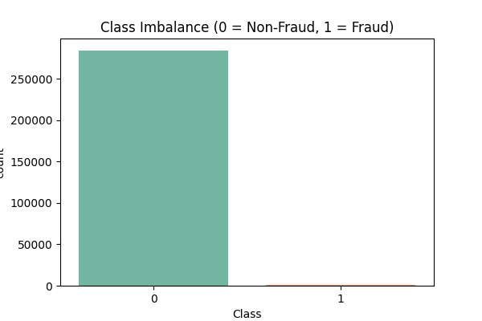
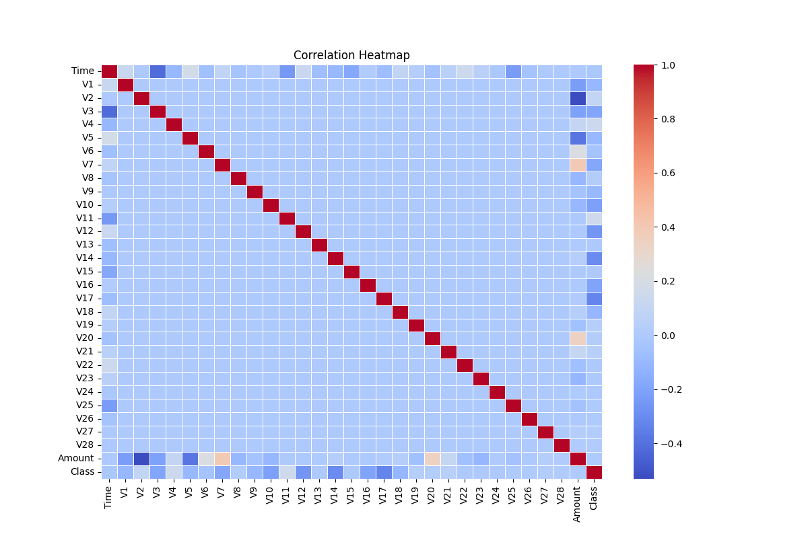
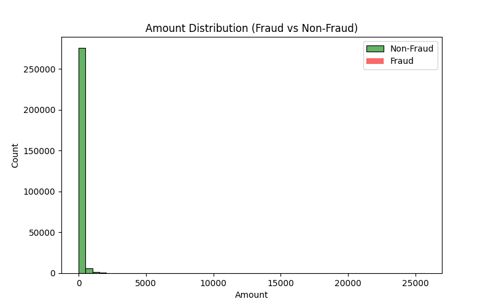
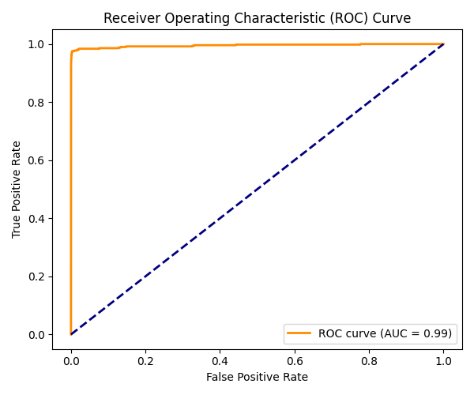

# Credit-Card-Fraud-Detection
A machine learning–based Credit Card Fraud Detection System built with Python and Streamlit. It detects fraudulent transactions using a trained model with SMOTE balancing, real-time prediction dashboard, and data visualization for better financial security.

Dataset used: https://www.kaggle.com/mlg-ulb/creditcardfraud
Download and place it in the Data folder before training.


# 💳 Credit Card Fraud Detection


## 📘 Overview

Credit card fraud is a significant financial threat worldwide.  
This project aims to detect fraudulent transactions using **Machine Learning algorithms** to minimize false positives and ensure secure online payments.

---

## 🚀 Features
- Fraud detection using ML models (`Logistic Regression`, `Random Forest`, `XGBoost`)
- Real-time web interface built with **Streamlit**
- Highly imbalanced dataset handled via **SMOTE** technique
- Model evaluation using metrics like `Precision`, `Recall`, `F1-Score`, and `ROC-AUC`
- Interactive visualization of dataset & predictions

---

## 🧠 Tech Stack
| Category | Tools / Libraries |
|-----------|-------------------|
| Programming | Python |
| Data Handling | Pandas, NumPy |
| Visualization | Matplotlib, Seaborn |
| Machine Learning | Scikit-learn, XGBoost, Joblib |
| Web App | Streamlit |
| Deployment | Streamlit Cloud |

---

## 📊 Dataset Insights

The dataset contains **284,807 transactions**, of which only **492** are fraudulent (~0.17%).

### Example Visuals:

#### 🔹 Class Imbalance Visualization


#### 🔹 Correlation Heatmap


#### 🔹 Amount Distribution (Fraud vs Non-Fraud)


---

## 🧩 Model Performance

| Metric | Value |
|---------|--------|
| Accuracy | 99.92% |
| Precision | 0.86 |
| Recall | 0.78 |
| F1-Score | 0.82 |
| ROC-AUC | 0.97 |



---

## 🖥️ Streamlit App

Run the Streamlit app locally:
```bash
streamlit run app.py
